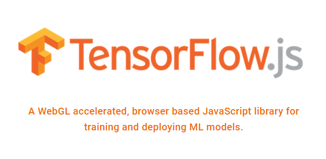

# **Chatbot AI menggunakan TensorFlow.js (Versi 1.0.0)**
---



--
**Deskripsi Proyek**

Proyek ini adalah sebuah chatbot AI sederhana yang dikembangkan menggunakan TensorFlow.js (Versi 1.0.0). Chatbot ini bertujuan untuk memberikan jawaban berdasarkan pertanyaan yang diterima dari pengguna. Dengan memanfaatkan teknologi NLP (Natural Language Processing) dan TensorFlow.js, chatbot ini dapat memahami niat (intent) dan entitas (entity) dari pertanyaan yang diajukan dan memberikan jawaban yang relevan.

**Teknologi yang Digunakan**

- **Node.js**: Platform runtime berbasis JavaScript yang digunakan untuk menjalankan kode JavaScript di sisi server.

- **Express.js**: Framework web untuk Node.js yang mempermudah pembuatan API dan aplikasi web.

- **@tensorflow/tfjs-tokenizer**: Paket yang digunakan untuk melatih tokenizer dan menyimpan hasilnya ke dalam file vocab.json. Tokenizer ini memproses teks menjadi token-token yang lebih mudah dipahami oleh model NLP.

- **node-nlp (NLP Manager)**: Paket untuk memproses teks dan melakukan analisis bahasa alami (Natural Language Processing). NLP Manager digunakan untuk mengelola dan melatih model-model NLP.

- **Sequelize**: ORM (Object-Relational Mapping) untuk Node.js yang memudahkan interaksi dengan database SQL.

- **MySQL**: Sistem manajemen basis data relasional (RDBMS) yang digunakan sebagai database proyek.

- **TensorFlow.js (Versi 1.0.0)**: Library machine learning berbasis JavaScript yang digunakan untuk membuat dan melatih model AI.

**Struktur Proyek**

```
|- config/
|    |- db/
|         |- database.js
|         |- App.js
|- models/
|    |- model.db.js
|- routes/
|    |- api.routes.js
|- utils/
|    |- tokenizer.js
|    |- nlp.js
|    |- authentication.js
|- server.js
|- package.json
|- package-lock.json
|- README.md
```

**Penjelasan Detail dari Setiap Script**

- **server.js**: File utama yang mengatur server dan routing. Middleware bodyParser digunakan untuk mengurai body dari request dalam format JSON. Mengimpor `apiRoutes` dari folder `routes` yang berisi definisi endpoint-endpoint API. Server berjalan pada port 3000 atau port yang ditentukan oleh environment variable `PORT`.

- **config/db/database.js**: File yang berisi konfigurasi koneksi ke database MySQL menggunakan Sequelize.

- **config/App.js**: File berisi definisi model-model Sequelize.

- **models/model.db.js**: Definisi model `ChatHistory` yang berisi riwayat percakapan chat.

- **routes/api.routes.js**: Definisi endpoint-endpoint API, seperti training tokenizer, chatbot dengan autentikasi JWT, login, refresh token, chatbot sederhana tanpa JWT, serta endpoint untuk mendapatkan dan menyimpan history chat.

- **utils/tokenizer.js**: Fungsi untuk melatih tokenizer dan menyimpan hasilnya ke dalam file vocab.json menggunakan `@tensorflow/tfjs-tokenizer`.

- **utils/nlp.js**: Fungsi untuk memproses query menggunakan NLP manager. NLP manager melakukan analisis bahasa alami dan mengenali intent serta entity dalam pertanyaan.

- **utils/authentication.js**: Fungsi-fungsi untuk autentikasi menggunakan JWT. Termasuk fungsi untuk menghasilkan token akses JWT (`generateAccessToken`) dan token refresh JWT (`generateRefreshToken`), serta fungsi-fungsi middleware untuk autentikasi token JWT dan autentikasi sederhana (tanpa JWT).

**Cara Menjalankan Proyek**

1. Pastikan telah menginstal Node.js dan MySQL.

2. Clone repository proyek ini.

3. Buka terminal atau command prompt, dan navigasi ke folder proyek.

4. Jalankan perintah `npm install` untuk menginstal dependensi.

5. Ubah konfigurasi koneksi database pada file `config/db/database.js`.

6. Jalankan perintah `node server.js` untuk menjalankan server.

7. API dapat diakses melalui alamat `http://localhost:3000/api`.

8. Selamat, proyek chatbot AI telah berjalan!

**Endpoint API:**
    - `/train-tokenizer`: Endpoint untuk melatih tokenizer (tanpa autentikasi).
    - `/chat`: Endpoint untuk chatbot dengan autentikasi JWT. Menggunakan metode POST dengan query parameter `question` untuk pertanyaan pengguna.
    - `/login`: Endpoint untuk mendapatkan token JWT (tanpa autentikasi). Menggunakan metode POST dengan body berisi `username` dan `password`.
    - `/refresh-token`: Endpoint untuk mendapatkan token akses baru dengan menggunakan refresh token. Menggunakan metode POST dengan body berisi `refreshToken`.
    - `/chat-simple`: Endpoint untuk chatbot dengan autentikasi sederhana (tanpa JWT). Menggunakan metode GET dengan query parameter `q` untuk pertanyaan pengguna.
    - `/history`: Endpoint untuk mendapatkan history chat (hanya untuk admin). Menggunakan metode GET dengan mengirimkan token JWT pada header Authorization.

**Catatan**

- Proyek ini adalah implementasi sederhana dan dapat dikembangkan lebih lanjut dengan fitur-fitur yang lebih kompleks dan canggih.

- Pastikan untuk menjaga keamanan dan kerahasiaan informasi sensitif seperti kredensial database dan kunci rahasia JWT. Selalu gunakan praktik keamanan terbaik saat mengembangkan proyek dengan fitur autentikasi.

- Proyek ini hanya sebagai contoh sederhana dan tidak dimaksudkan untuk digunakan secara produksi. Beberapa fitur seperti autentikasi sederhana mungkin tidak aman dalam lingkungan produksi dan perlu dikembangkan lebih lanjut.

## Kontribusi
Kontribusi pada proyek ini sangat diterima. Silakan lakukan pull request untuk saran dan perbaikan proyek ini.

## Lisensi
Proyek ini dilisensikan di bawah [MIT License](https://github.com/0xTrue-DevAI/Chatbot-AI/blob/main/LICENSE). Anda bebas menggunakan dan memodifikasi proyek ini sesuai dengan ketentuan lisensi.

## Kontak
Jika Anda memiliki pertanyaan atau masalah terkait proyek ini, silakan hubungi kami melalui email di [Email](mailto:eotnay@gmail.com).

---
